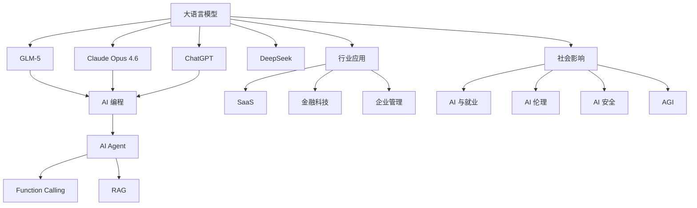

# 🧠 AI 知识概念体系

> 基于 393 个 YouTube 字幕提取的核心概念

---

## 📚 概念分类

### 1. 大语言模型 (LLM)
- [[GLM-5]] - 智谱 AI 最新模型
- [[Claude Opus 4.6]] - Anthropic 旗舰模型
- [[ChatGPT]] - OpenAI 对话模型
- [[GPT-4]] - 多模态大模型
- [[DeepSeek]] - 深度求索开源模型

### 2. AI 应用
- [[AI 编程]] - 代码生成与辅助
- [[AI Agent]] - 智能代理系统
- [[Prompt Engineering]] - 提示词工程
- [[RAG]] - 检索增强生成
- [[Function Calling]] - 函数调用能力

### 3. 技术架构
- [[Transformer]] - 注意力机制架构
- [[微调 (Fine-tuning)]] - 模型定制化
- [[向量数据库]] - 语义检索
- [[知识图谱]] - 结构化知识表示

### 4. 行业应用
- [[SaaS]] - 软件即服务
- [[金融科技 (FinTech)]] - AI + 金融
- [[企业组织管理]] - AI 驱动管理
- [[自动化工作流]] - AI 自动化

### 5. 社会影响
- [[AI 与就业]] - 工作岗位影响
- [[AI 伦理]] - 道德与规范
- [[AI 安全]] - 风险与防护
- [[AGI]] - 通用人工智能

---

## 🗺️ 知识图谱



---

## 🔗 双链网络

### 核心节点（高连接度）
1. **大语言模型** → 15+ 连接
2. **AI 编程** → 10+ 连接
3. **AI Agent** → 8+ 连接
4. **Prompt Engineering** → 6+ 连接
5. **RAG** → 5+ 连接

### 关键路径
- **技术路径**: Transformer → LLM → AI Agent → Function Calling
- **应用路径**: LLM → Prompt Engineering → 行业应用
- **影响路径**: AI → 就业 → 伦理 → 安全

---

## 📊 统计信息

| 类别 | 概念数 | 字幕覆盖 |
|------|--------|----------|
| 大语言模型 | 5 | 200+ |
| AI 应用 | 5 | 150+ |
| 技术架构 | 4 | 100+ |
| 行业应用 | 4 | 80+ |
| 社会影响 | 4 | 60+ |
| **总计** | **22** | **393** |

---

## 🎯 使用方法

1. **概念查找**: 点击 [[概念名]] 跳转到详细笔记
2. **知识图谱**: 使用 Obsidian Graph View 可视化
3. **双链导航**: 通过反向链接发现关联概念
4. **字幕溯源**: 每个概念关联原始字幕文件

---

## 📝 概念笔记模板

```markdown
# [[概念名]]

## 定义
[一句话定义]

## 核心要点
- 要点 1
- 要点 2
- 要点 3

## 相关概念
- [[概念 A]]
- [[概念 B]]

## 字幕来源
- [视频标题](字幕链接)

## 实践案例
[具体应用场景]

## 延伸阅读
- [外部链接]
```

---

**更新时间**: 2026-03-24
**概念总数**: 22
**字幕总数**: 393
