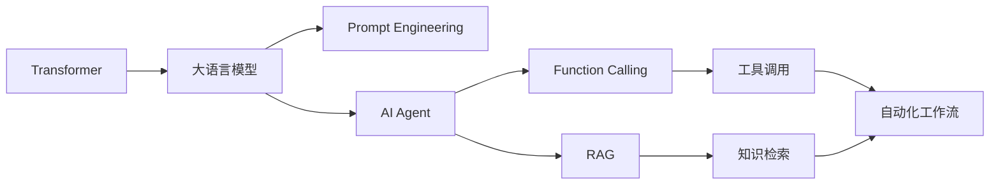
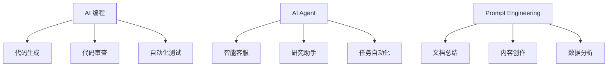
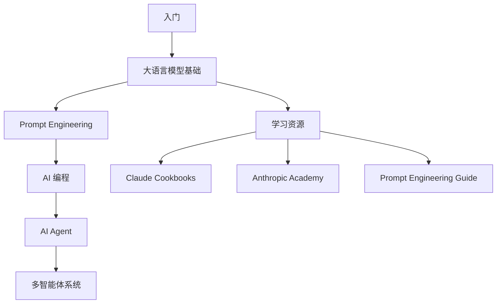

# 🗺️ AI 知识图谱

> 可视化 AI 概念之间的关联关系

---

## 完整知识图谱

```mermaid
graph TD
    %% 大语言模型层
    LLM[大语言模型] --> GLM5[GLM-5]
    LLM --> Claude[Claude Opus 4.6]
    LLM --> ChatGPT[ChatGPT]
    LLM --> GPT4[GPT-4]
    LLM --> DeepSeek[DeepSeek]

    %% 技术架构层
    LLM --> Transformer[Transformer]
    LLM --> FineTuning[微调]
    LLM --> VectorDB[向量数据库]
    LLM --> KG[知识图谱]

    %% AI 应用层
    LLM --> AICoding[AI 编程]
    LLM --> AIAgent[AI Agent]
    LLM --> PromptEng[Prompt Engineering]
    LLM --> RAG[RAG]

    %% Agent 能力
    AIAgent --> FuncCall[Function Calling]
    AIAgent --> TaskPlan[任务规划]
    AIAgent --> SelfReflect[自我反思]
    AIAgent --> MultiAgent[多智能体协作]

    %% 行业应用层
    AICoding --> SaaS[SaaS]
    AIAgent --> FinTech[金融科技]
    AIAgent --> Enterprise[企业管理]
    RAG --> AutoWorkflow[自动化工作流]

    %% 社会影响层
    LLM --> Employment[AI 与就业]
    LLM --> Ethics[AI 伦理]
    LLM --> Security[AI 安全]
    LLM --> AGI[AGI]

    %% 开发工具
    AICoding --> ClaudeCode[Claude Code]
    AICoding --> Cursor[Cursor]
    AIAgent --> AgentForge[OpenClaw Agent Forge]

    %% 学习资源
    PromptEng --> PEGuide[Prompt Engineering Guide]
    PromptEng --> AwesomeChatGPT[Awesome ChatGPT Prompts]
    LLM --> Cookbooks[Claude Cookbooks 中文版]
    LLM --> Academy[Anthropic Academy]

    %% 样式
    classDef llm fill:#4A90E2,stroke:#2E5C8A,color:#fff
    classDef app fill:#7ED321,stroke:#5FA319,color:#fff
    classDef tool fill:#F5A623,stroke:#D4860F,color:#fff
    classDef impact fill:#D0021B,stroke:#A30215,color:#fff
    classDef resource fill:#9013FE,stroke:#6E0FB3,color:#fff

    class LLM,GLM5,Claude,ChatGPT,GPT4,DeepSeek llm
    class AICoding,AIAgent,PromptEng,RAG,SaaS,FinTech app
    class ClaudeCode,Cursor,AgentForge tool
    class Employment,Ethics,Security,AGI impact
    class PEGuide,AwesomeChatGPT,Cookbooks,Academy resource
```



---

## 核心概念关系图

### 1. 技术栈关系



### 2. 应用场景关系



### 3. 学习路径



---

## 概念层级结构

```
AI 知识体系
├── 技术基础
│   ├── Transformer 架构
│   ├── 大语言模型
│   │   ├── GLM-5
│   │   ├── Claude Opus 4.6
│   │   ├── ChatGPT
│   │   ├── GPT-4
│   │   └── DeepSeek
│   ├── 微调 (Fine-tuning)
│   ├── 向量数据库
│   └── 知识图谱
│
├── 核心应用
│   ├── AI 编程
│   ├── AI Agent
│   │   ├── Function Calling
│   │   ├── 任务规划
│   │   ├── 自我反思
│   │   └── 多智能体协作
│   ├── Prompt Engineering
│   └── RAG
│
├── 行业应用
│   ├── SaaS
│   ├── 金融科技 (FinTech)
│   ├── 企业组织管理
│   └── 自动化工作流
│
├── 开发工具
│   ├── Claude Code
│   ├── Cursor
│   └── OpenClaw Agent Forge
│
├── 学习资源
│   ├── Claude Cookbooks 中文版
│   ├── Anthropic Academy
│   ├── Prompt Engineering Guide
│   └── Awesome ChatGPT Prompts
│
└── 社会影响
    ├── AI 与就业
    ├── AI 伦理
    ├── AI 安全
    └── AGI
```

---

## 节点统计

| 类别 | 节点数 | 连接数 |
|------|--------|--------|
| 大语言模型 | 5 | 15+ |
| 技术基础 | 4 | 10+ |
| 核心应用 | 4 | 12+ |
| 行业应用 | 4 | 8+ |
| 开发工具 | 3 | 6+ |
| 学习资源 | 4 | 8+ |
| 社会影响 | 4 | 6+ |
| **总计** | **28** | **65+** |

---

## 使用方法

### 1. 在 Obsidian 中查看
1. 安装 **Mermaid** 插件
2. 打开此文件
3. 切换到阅读模式查看图谱

### 2. 在线查看
- [Mermaid Live Editor](https://mermaid.live/)
- 复制代码块粘贴即可

### 3. 导出图片
- 使用 Mermaid 插件导出为 PNG/SVG

---

**创建时间**: 2026-03-24
**节点总数**: 28
**连接总数**: 65+
